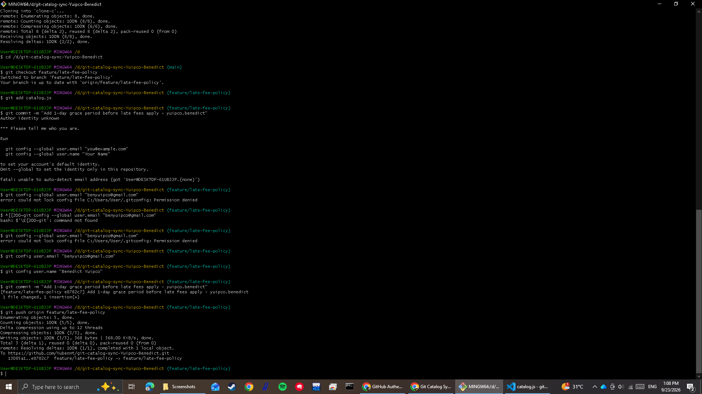
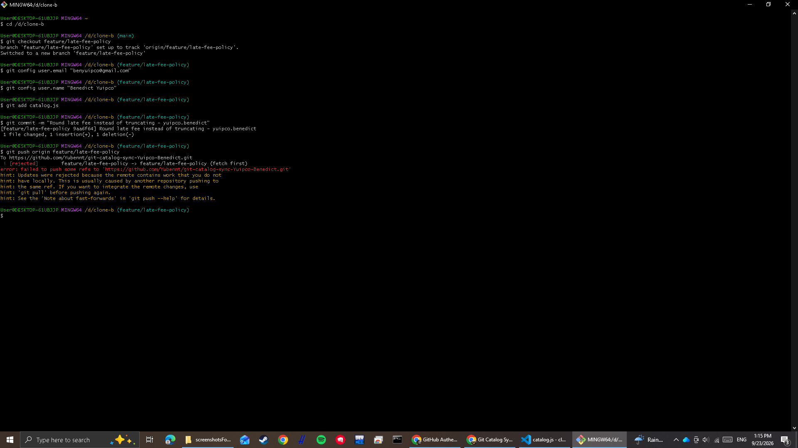
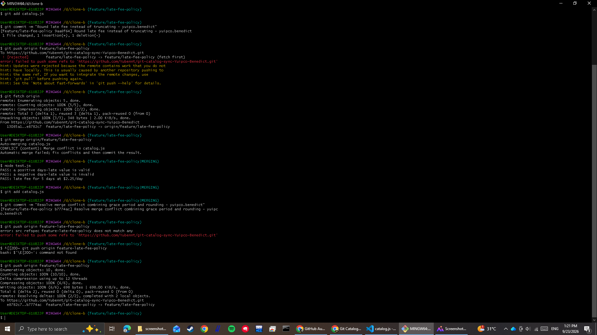
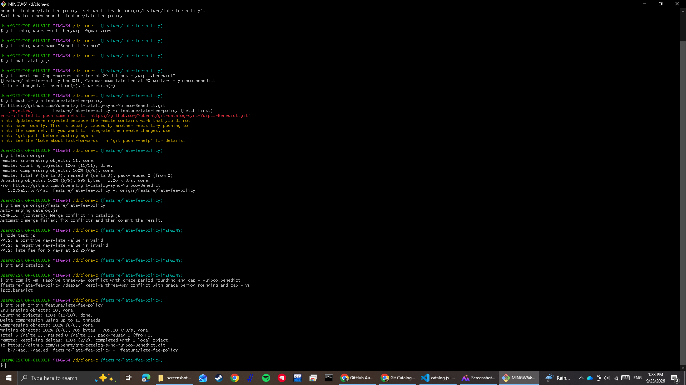
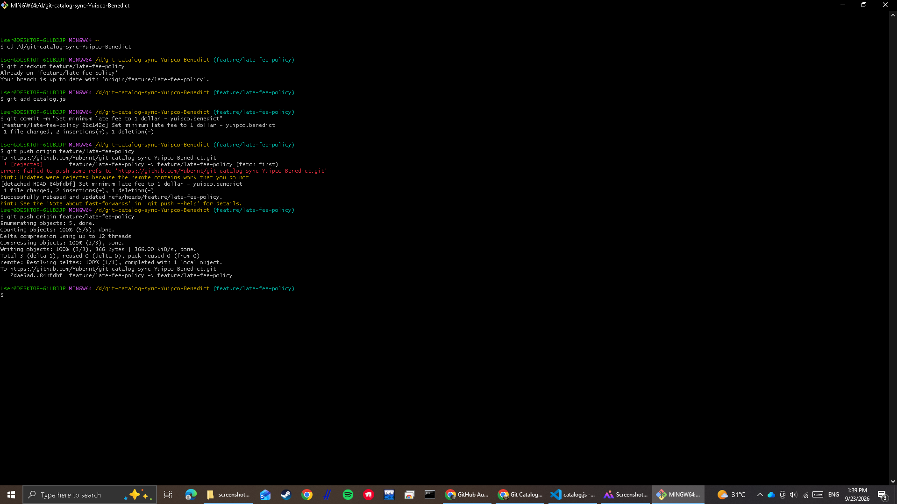
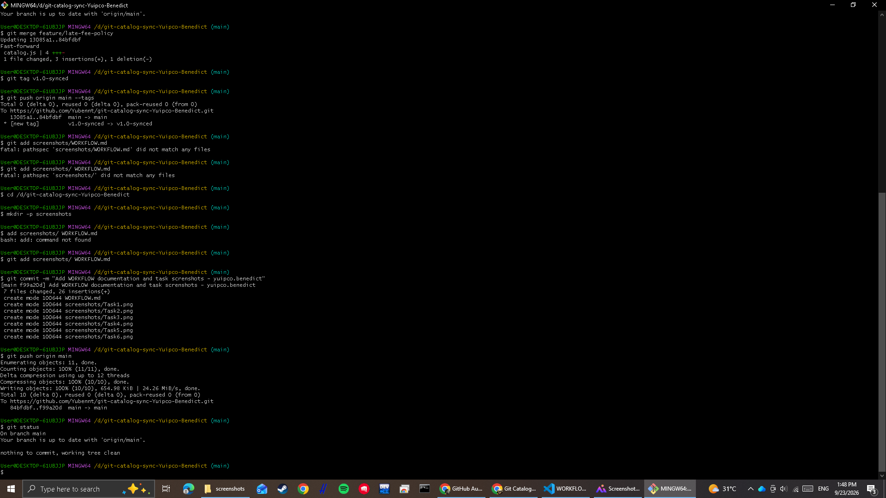

# Git Catalog Sync Workflow Report

## Code Attribution
In the final `calculateLateFee` function:
- **1-Day Grace Period (`if (daysLate <= 1) return 0;`):** Added by Contributor 1 (Clone A, Task 1).
- **Rounding Late Fee (`Math.round(...)`):** Added by Contributor 2 (Clone B, Task 2).
- **$20 Maximum Fee Cap (`Math.min(20, ...)`):** Added by Contributor 3 (Clone C, Task 4).
- **$1 Minimum Fee (`Math.max(1, ...)`):** Added by Contributor 1 (Clone A, Task 6).

## 2-Way Conflict vs. 3-Way Conflict
Task 3 was a standard two-way conflict where Clone B had to resolve direct line-level differences between Clone A's grace period and Clone B's rounding rule. Task 5 was significantly harder because Clone C had diverged from an older commit state while upstream accumulated multiple stacked commits from both Clone A and Clone B. Resolving the three-way conflict required evaluating how three separate policy rules interacted simultaneously without dropping any contributor's work.

## Merge vs. Rebase Resolution Difference
In Task 5, using `git merge` preserved the explicit branching history by creating a dedicated merge commit that joined Clone C's branch back into `feature/late-fee-policy`. In Task 6, using `git rebase` rewrote local commit history by replaying Clone A's new commit directly on top of `origin/feature/late-fee-policy`, creating a clean, linear sequence of commits without generating a merge commit.

## Process Improvement
To prevent all three rejected pushes, the team should adopt a process where contributors communicate before pushing and pull upstream changes frequently (`git pull --rebase origin feature/late-fee-policy`) before making or pushing local commits. Alternatively, using short-lived feature branches with Pull Requests (PRs) and branch protection rules would ensure code integration happens sequentially via peer review.

## Screenshots

